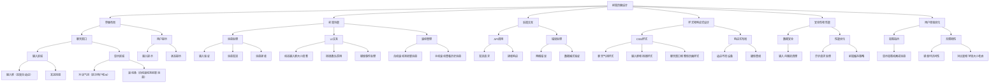

# 开发手册
## 思维导图

```mermaid
graph TD
    A[前端页面设计] --> B[界面布局]
    A --> C[前端功能]
    A --> D[后端交互]
    A --> E[样式和响应式设计]
    A --> F[安全性和性能]
    A --> G[用户体验优化]

    B --> B1[聊天窗口]
    B1 --> B1a[输入区域]
    B1a --> B1a1[输入框（高度自适应）]
    B1a --> B1a2[发送按钮]
    B1 --> B1b[显示区域]
    B1b --> B1b1[对话气泡（区分用户和AI）]
    B1b --> B1b2[滚动条（自动滚动到最新消息）]
    B --> B2[用户提示]
    B2 --> B2a[输入提示]
    B2 --> B2b[状态提示]

    C --> C1[消息处理]
    C1 --> C1a[输入验证]
    C1 --> C1b[消息发送]
    C1 --> C1c[消息接收]
    C --> C2[UI交互]
    C2 --> C2a[动态输入框大小调整]
    C2 --> C2b[按钮激活/禁用]
    C2 --> C2c[键盘事件处理]
    C --> C3[滚动管理]
    C3 --> C3a[自动滚动到最新消息]
    C3 --> C3b[手动滚动查看历史消息]

    D --> D1[API调用]
    D1 --> D1a[发送请求]
    D1 --> D1b[接收响应]
    D --> D2[错误处理]
    D2 --> D2a[网络错误]
    D2 --> D2b[数据格式验证]

    E --> E1[CSS/样式]
    E1 --> E1a[聊天气泡样式]
    E1 --> E1b[输入框和按钮样式]
    E1 --> E1c[聊天窗口和整体页面样式]
    E --> E2[响应式布局]
    E2 --> E2a[适应不同设备]
    E2 --> E2b[媒体查询]

    F --> F1[数据安全]
    F1 --> F1a[输入内容的清理]
    F --> F2[性能优化]
    F2 --> F2a[异步请求处理]
    F2 --> F2b[前端缓存策略]

    G --> G1[加载指示]
    G1 --> G1a[显示加载动画或消息]
    G --> G2[无障碍性]
    G2 --> G2a[键盘可访问性]
    G2 --> G2b[对比度和字体大小考虑]


```
